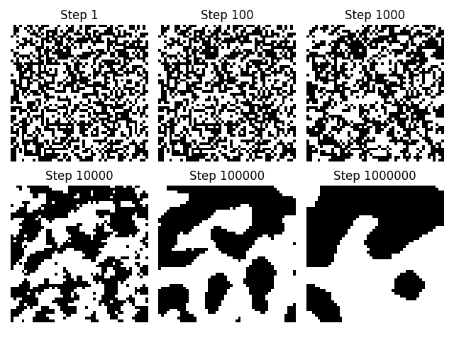

### Conserved Ising Simulation and the Kawasaki Model

The following branch constains a simulation to model a conserved ising 
model using the Kawasaki method. The result is an interesting clumping of 
spins and convergence into full seperation between spins.

Here is an image of the results after 1 million steps:

